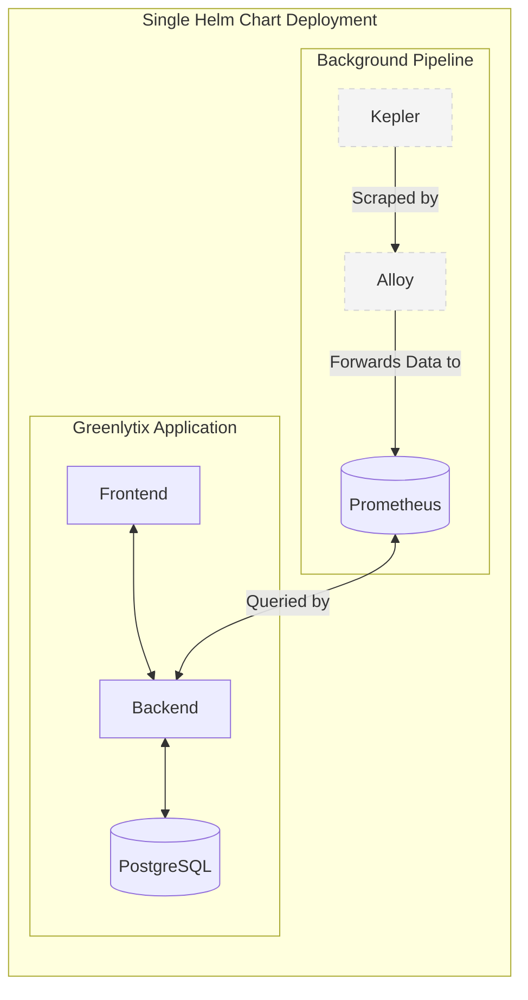

# Greenlytix Architecture

## Overview
Greenlytix is an application that provides insights into infrastructure power consumption, carbon footprint, and sustainability. Beneath the surface, it leverages **Kepler** (Kubernetes-based Efficient Power Level Exporter) as its core power measurement engine. To provide a seamless, branded experience, Kepler operates entirely in the background and is abstracted away from the end user. 

The underlying data pipeline uses **Alloy** to ingest power metrics from Kepler and forward them to **Prometheus** for storage and querying by the Greenlytix backend. The entire stack, including the application code and background tools, is deployed seamlessly via a single unified Helm chart.

## Components
1. **Greenlytix Frontend:** The user-facing web interface that users interact with.
2. **Greenlytix Backend:** The core application logic that serves the frontend, queries Prometheus for power data, and manages application state.
3. **PostgreSQL:** The relational database used by the Greenlytix Backend to store user data, application configurations, and metadata.
4. **Kepler:** Running in the background, it captures and calculates power consumption metrics for the infrastructure at the node, pod, and container levels.
5. **Alloy:** Acts as the telemetry collector (Grafana Alloy). It is responsible for grabbing power metrics from Kepler.
6. **Prometheus:** The time-series database where all gathered metrics from Alloy are stored and queried by the Greenlytix Backend.

## Data Flow

1. **Metric Generation:** Kepler analyzes infrastructure power usage and exposes energy metrics.
2. **Data Collection:** Alloy scrapes the exported metrics from Kepler.
3. **Data Forwarding:** Alloy processes and forwards (e.g., via remote write) the captured metrics to Prometheus.
4. **Data Querying & Visualization:** The Greenlytix Backend queries Prometheus for the energy data, processes it, and serves it to the Greenlytix Frontend for visualization.

## Deployment Strategy
To guarantee a smooth rollout and simplified management, the entire application stack and its background dependencies are packaged together:

- **Unified Single Helm Chart:** We will create a single, comprehensive Helm chart that deploys the application code (**Frontend** and **Backend**), the database (**PostgreSQL**), and the background tools (**Kepler** and **Alloy**).
    - **All-in-One Provisioning:** Deploying this one chart spins up the UI, the API, the database, and the power-monitoring pipeline simultaneously.
    - **Pre-configured Integrations:** The chart automatically configures the Backend to connect to PostgreSQL and Prometheus. It also configures Alloy's scrape targets to point to the local Kepler instance and sets up the forwarding rules for Prometheus.
    - **Encapsulation:** By deploying everything together, we maintain strict control over versions, configurations, and internal networking, ensuring dependencies like Kepler remain strictly isolated as background utilities.
