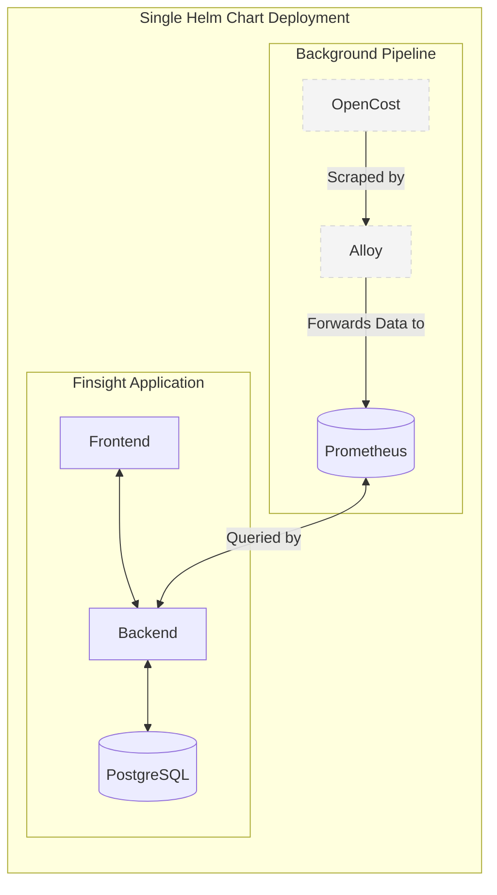

# Finsight Architecture

## Overview
Finsight is an application that provides cloud and infrastructure cost insights. Beneath the surface, it leverages **OpenCost** as its core calculation engine. To provide a seamless, branded experience, OpenCost operates entirely in the background and is abstracted away from the end user. 

The underlying data pipeline uses **Alloy** to ingest metrics from OpenCost and forward them to **Prometheus** for storage and querying by the Finsight backend. The entire stack, including the application code and background tools, is deployed seamlessly via a single unified Helm chart.

## Components
1. **Finsight Frontend:** The user-facing web interface that users interact with.
2. **Finsight Backend:** The core application logic that serves the frontend, queries Prometheus for cost data, and manages application state.
3. **PostgreSQL:** The relational database used by the Finsight Backend to store user data, application configurations, and metadata.
4. **OpenCost:** Running in the background, it calculates cost allocation and usage metrics for the infrastructure.
5. **Alloy:** Acts as the telemetry collector (Grafana Alloy). It is responsible for grabbing cost metrics from OpenCost.
6. **Prometheus:** The time-series database where all gathered cost metrics from Alloy are stored and queried by the Finsight Backend.

## Data Flow

1. **Metric Generation:** OpenCost analyzes infrastructure usage and exposes cost metrics.
2. **Data Collection:** Alloy scrapes the exported metrics from OpenCost.
3. **Data Forwarding:** Alloy processes and forwards (e.g., via remote write) the captured metrics to Prometheus.
4. **Data Querying & Visualization:** The Finsight Backend queries Prometheus for the cost data, processes it, and serves it to the Finsight Frontend for visualization.

## Deployment Strategy
To guarantee a smooth rollout and simplified management, the entire application stack and its background dependencies are packaged together:

- **Unified Single Helm Chart:** We will create a single, comprehensive Helm chart that deploys the application code (**Frontend** and **Backend**), the database (**PostgreSQL**), and the background tools (**OpenCost** and **Alloy**).
    - **All-in-One Provisioning:** Deploying this one chart spins up the UI, the API, the database, and the cost-monitoring pipeline simultaneously.
    - **Pre-configured Integrations:** The chart automatically configures the Backend to connect to PostgreSQL and Prometheus. It also configures Alloy's scrape targets to point to the local OpenCost instance and sets up the forwarding rules for Prometheus.
    - **Encapsulation:** By deploying everything together, we maintain strict control over versions, configurations, and internal networking, ensuring dependencies like OpenCost remain strictly isolated as background utilities.
