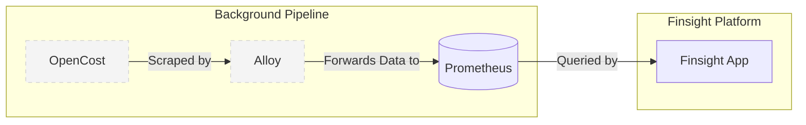

# Finsight Architecture

## Overview
Finsight is an application that provides cloud and infrastructure cost insights. Beneath the surface, it leverages **OpenCost** as its core calculation engine. To provide a seamless, branded experience, OpenCost operates entirely in the background and is abstracted away from the end user. 

The underlying data pipeline uses **Alloy** to ingest metrics from OpenCost and forward them to **Prometheus** for storage and querying by the Finsight application.

## Components
1. **Finsight Application:** The user-facing interface that users interact with. It does not expose OpenCost directly.
2. **OpenCost:** Running in the background, it calculates cost allocation and usage metrics for the infrastructure.
3. **Alloy:** Acts as the telemetry collector (Grafana Alloy). It is responsible for grabbing cost metrics from OpenCost.
4. **Prometheus:** The time-series database where all gathered cost metrics from Alloy are stored and queried by Finsight.

## Data Flow

1. **Metric Generation:** OpenCost analyzes infrastructure usage and exposes cost metrics.
2. **Data Collection:** Alloy scrapes the exported metrics from OpenCost.
3. **Data Forwarding:** Alloy processes and forwards (e.g., via remote write) the captured metrics to Prometheus.
4. **Data Visualization:** Finsight queries Prometheus to display cost data to the user.

## Deployment Strategy
To guarantee a smooth rollout, the background dependencies are packaged together:

- **Custom Helm Chart:** We will create a proprietary Helm chart that installs both **OpenCost** and **Alloy** simultaneously.
    - **Alloy Configuration:** The chart will automatically configure Alloy's scrape targets to point to the local OpenCost instance and set up the forwarding rules for Prometheus.
    - **Encapsulation:** By deploying them together via our own chart, we maintain control over the exact versions, configurations, and communication between OpenCost and Alloy, keeping OpenCost strictly as a background dependency.
