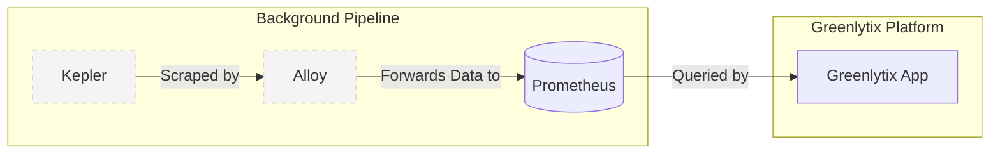

# Greenlytix Architecture

## Overview
Greenlytix is an application that provides insights into infrastructure power consumption, carbon footprint, and sustainability. Beneath the surface, it leverages **Kepler** (Kubernetes-based Efficient Power Level Exporter) as its core power measurement engine. To provide a seamless, branded experience, Kepler operates entirely in the background and is abstracted away from the end user. 

The underlying data pipeline uses **Alloy** to ingest power metrics from Kepler and forward them to **Prometheus** for storage and querying by the Greenlytix application.

## Components
1. **Greenlytix Application:** The user-facing interface that users interact with. It does not expose Kepler directly.
2. **Kepler:** Running in the background, it captures and calculates power consumption metrics for the infrastructure at the node, pod, and container levels.
3. **Alloy:** Acts as the telemetry collector (Grafana Alloy). It is responsible for grabbing power metrics from Kepler.
4. **Prometheus:** The time-series database where all gathered metrics from Alloy are stored and queried by Greenlytix.

## Data Flow

1. **Metric Generation:** Kepler analyzes infrastructure power usage and exposes energy metrics.
2. **Data Collection:** Alloy scrapes the exported metrics from Kepler.
3. **Data Forwarding:** Alloy processes and forwards (e.g., via remote write) the captured metrics to Prometheus.
4. **Data Visualization:** Greenlytix queries Prometheus to display sustainability and energy data to the user.

## Deployment Strategy
To guarantee a smooth rollout, the background dependencies are packaged together:

- **Custom Helm Chart:** We will create a proprietary Helm chart that installs both **Kepler** and **Alloy** simultaneously.
    - **Alloy Configuration:** The chart will automatically configure Alloy's scrape targets to point to the local Kepler instance and set up the forwarding rules for Prometheus.
    - **Encapsulation:** By deploying them together via our own chart, we maintain control over the exact versions, configurations, and communication between Kepler and Alloy, keeping Kepler strictly as a background dependency.
